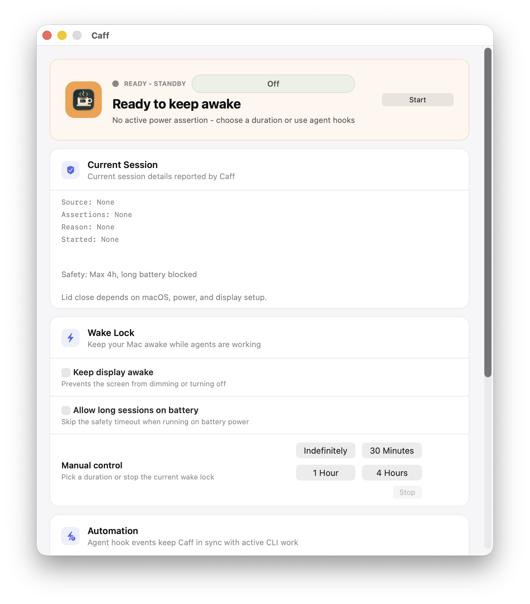

# Caff

Caff is a small macOS menu bar app that keeps the machine awake while long-running agent tasks are active. It can be driven manually, by agent hook events, or by CLI/URL commands.



It uses the official IOKit power assertion API:

- `PreventUserIdleSystemSleep` keeps macOS from sleeping because the user is idle.
- `NoDisplaySleepAssertion` is optional and keeps the display awake when enabled.

## Install

Install with Homebrew:

```bash
brew install --cask majiayu000/caff/caff
```

Or tap first:

```bash
brew tap majiayu000/caff
brew install --cask caff
```

You can also download the latest release zip:

https://github.com/majiayu000/caff/releases/latest

Unzip `Caff.app`, drag it to Applications, then open Caff.

To build and install from source:

```bash
git clone https://github.com/majiayu000/caff.git
cd caff
./scripts/install.sh
```

Source install requires macOS 13+ and Xcode Command Line Tools. To install somewhere else:

```bash
CAFF_INSTALL_DIR="$HOME/Applications" ./scripts/install.sh
```

For maintainers, `./scripts/package_release.sh` builds `dist/Caff-<version>.zip` and its `.sha256` file for GitHub Releases.

## Quick Start

Most users only need the manual controls:

1. Open Caff:

   ```bash
   open -a Caff
   ```

2. Click `30 Minutes`, `1 Hour`, or `4 Hours`.
3. Leave `Keep display awake` off unless the screen itself must stay on.
4. When your task is done, click `Stop` from the control window or the `CAFF` menu bar item.

When Caff is running, look for `CAFF` in the macOS menu bar.

## Which Mode Should I Use?

| Need | Use |
| --- | --- |
| Keep the Mac awake for a known amount of time | Manual buttons: `30 Minutes`, `1 Hour`, `4 Hours` |
| Keep the display on too | Turn on `Keep display awake` before starting |
| Keep awake while Codex or Claude activity is happening | `agent-touch` hooks |
| Start, stop, or inspect Caff from scripts | CLI or `caff://` URLs |

Start with manual mode. Turn on agent hooks when manual sessions are not enough for interactive Codex or Claude work.

## Language

Caff supports English and Simplified Chinese. It follows the preferred macOS language by default, and you can switch language from the menu bar or the control window settings without changing the system language. English is the fallback language.

## What Caff Is Not

Caff is not an agent launcher, terminal replacement, job runner, or generic process/workspace watcher. Run Codex, Claude, tests, and scripts in your normal terminal or editor. Use Caff to keep the Mac awake while that work is active.

## Current Scope

This MVP implements an idle-sleep/display-sleep assertion controller, a menu bar item, a light Aqua control window, local history, and CLI/URL control. It does not claim reliable lid-closed operation on every MacBook setup. Lid-close behavior depends on hardware, power, external display state, and macOS policy, so it should be validated separately before treating it as production behavior.

## Control Window

The app opens a scrollable control window with:

- a hero status card for the current wake-lock state
- current session details reported by Caff
- manual wake-lock duration controls
- agent activity hook status and hook management
- notification and local history controls

## Safety Policy

Caff keeps display sleep prevention opt-in and applies a visible safety policy before starting sessions:

- manual sessions are capped at 4 hours, including the "Indefinitely" action
- long sessions are blocked while on battery unless the user explicitly enables them
- assertion and policy failures stay visible in the menu bar, menu, and control window

## Notifications and History

Notifications are opt-in. When enabled, Caff can notify on session start, stop, timeout, policy stop, and errors.
Local history is stored in Application Support and records source, reason, duration, assertion kinds, timestamps, and result.
History starts empty and can be cleared from the menu or control window.

## Settings

Caff persists menu bar density and launch behavior. The menu bar can show icon-only, `CAFF`, compact countdown, or source labels, and the control window can be disabled on launch.

## CLI and URL Control

The same executable accepts `start`, `stop`, `status`, `agent-touch`, `install-hooks`, and `remove-hooks` commands. `start` supports `--minutes`, `--reason`, `--display-awake`, and `--source`; `status` prints the latest Caff app snapshot, including source, requested assertions, reason, timestamps, display-awake state, agent cooldown state, the last received agent-touch event, and errors. The app bundle registers URL commands for equivalent control:

- `caff://start?minutes=30&reason=agent`
- `caff://stop`
- `caff://agent-touch?source=codex&cooldownSeconds=1800`

For long-running interactive agent CLIs, `agent-touch` refreshes a last-activity cooldown without relying on the `codex` or `claude` process exiting:

```bash
caff agent-touch --source codex --cooldown-seconds 1800
```

Hook the agent events that fire during a turn to run that command. For Claude Code, use `UserPromptSubmit`, `PreToolUse`, `PostToolUse`, and `Stop`; for Codex, use the supported hook events in your `hooks.json`, such as `SessionStart`, `PreToolUse`, `PostToolUse`, and `Stop`. Caff keeps the Mac awake until 30 minutes after the latest agent event, then releases the assertion so macOS can follow its normal sleep policy.

If you run from the generated app bundle, the executable path is:

```bash
dist/Caff.app/Contents/MacOS/Caff agent-touch --source codex --cooldown-seconds 1800
```

## Agent Activity Hooks

Use this mode when a long-running interactive agent may stay open after it has finished answering. Hook events provide the explicit activity signal Caff uses for automation.

Configure your agent hooks to run:

```bash
/Applications/Caff.app/Contents/MacOS/Caff agent-touch --source codex --cooldown-seconds 1800
```

Or let Caff install/remove supported Codex and Claude hooks:

```bash
/Applications/Caff.app/Contents/MacOS/Caff install-hooks
/Applications/Caff.app/Contents/MacOS/Caff remove-hooks
```

Use `--target codex` or `--target claude` to manage one tool, and `--cooldown-seconds 1800` to customize the installed cooldown. The control window also has `Install Hooks` and `Remove Hooks` buttons in the Agent Activity Hook section. Hook install updates `~/.codex/hooks.json` and `~/.claude/settings.json`, preserving existing non-Caff hooks. Hook removal only removes Caff `agent-touch` hooks.

Run it on these events when available:

- user prompt submitted
- before tool use
- after tool use
- stop or completion

Each event refreshes the cooldown. If no new event arrives for 30 minutes, Caff releases the wake assertion.

Copy-pasteable hook snippets are available in `examples/codex-hooks.json` and `examples/claude-settings-hooks.json`.

## Run

```bash
swift run caff
```

## Build an App Bundle

```bash
./scripts/build_app.sh
open dist/Caff.app
```

The generated app opens the control window and also keeps a `CAFF` menu bar item.
The menu includes `Show Caff` if the window is closed.

## Install and Open

Caff does not require a package installer. To build and install from source:

```bash
./scripts/install.sh
```

After building the app bundle, you can also run it from `dist`:

```bash
open dist/Caff.app
```

or copy it to Applications and open it like a normal Mac app:

```bash
ditto dist/Caff.app /Applications/Caff.app
open -a Caff
```

When Caff is running, look for `CAFF` in the macOS menu bar. Use the menu bar item to open `Show Caff`, start or stop a wake session, change menu bar display mode, or quit the app.

## Status Snapshot

When a wake session is active, Caff shows:

- session source: `Manual`, `Agent`, `CLI`, or `URL`
- assertion types requested by Caff
- assertion reason
- start time
- remaining time for timed sessions
- agent activity summary, cooldown end time, and last received `agent-touch` source/time in CLI status

## Naming

`Caff` is intentionally short and CLI-friendly. It keeps the connection to macOS `caffeinate` without using the generic name `Cafe`.

## Verify

```bash
swift test
swift build
swift run caff-core-checks
./scripts/build_app.sh
```

## Release Notes

See [CHANGELOG.md](CHANGELOG.md).

## License

Caff is available under the [MIT License](LICENSE).
